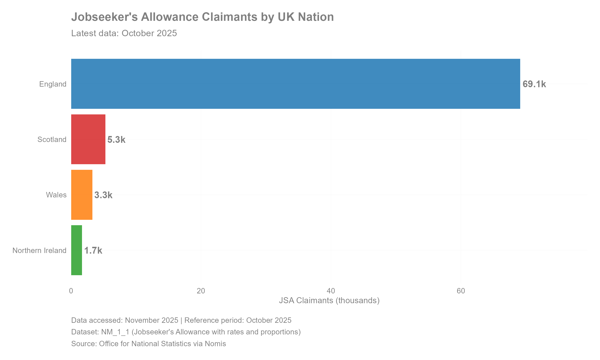
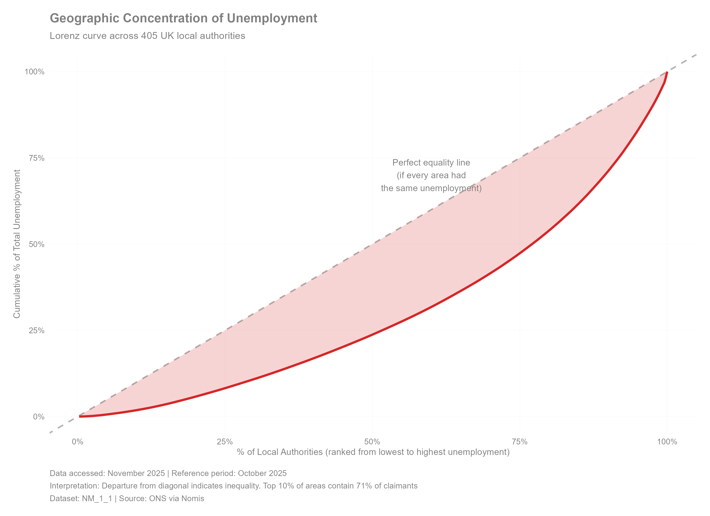
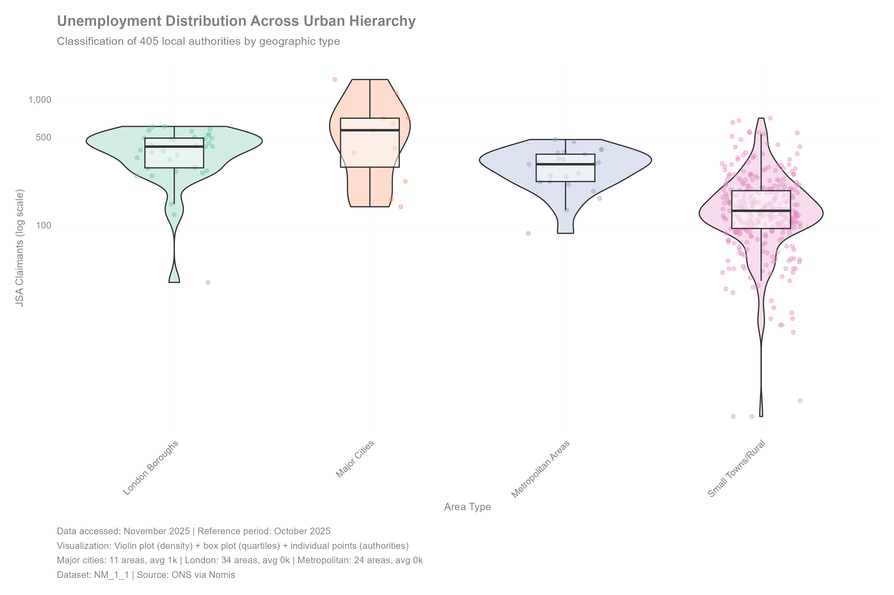
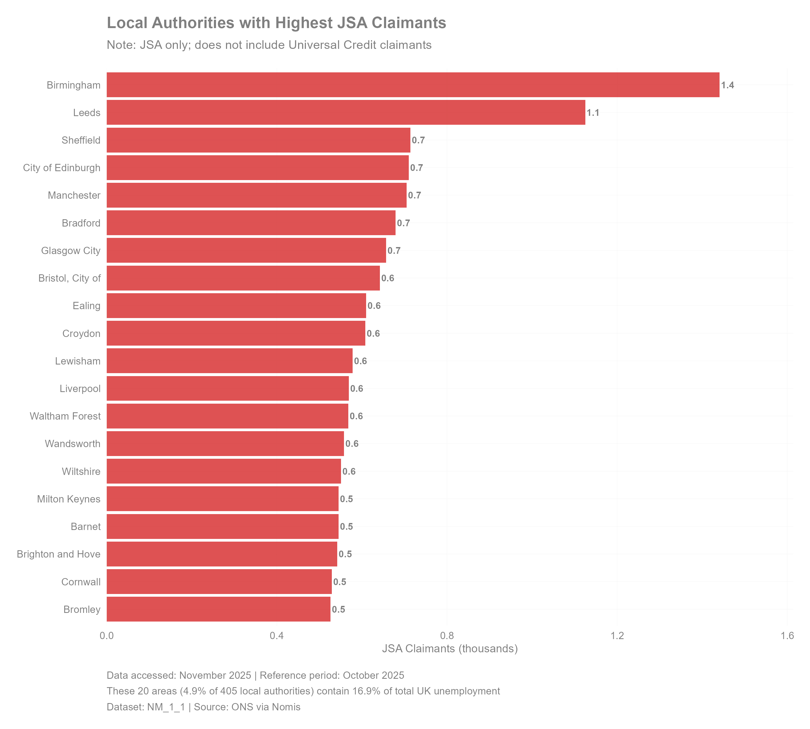
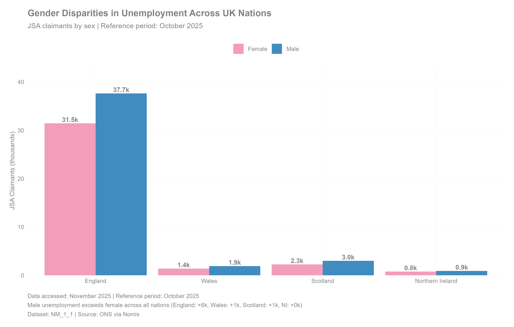
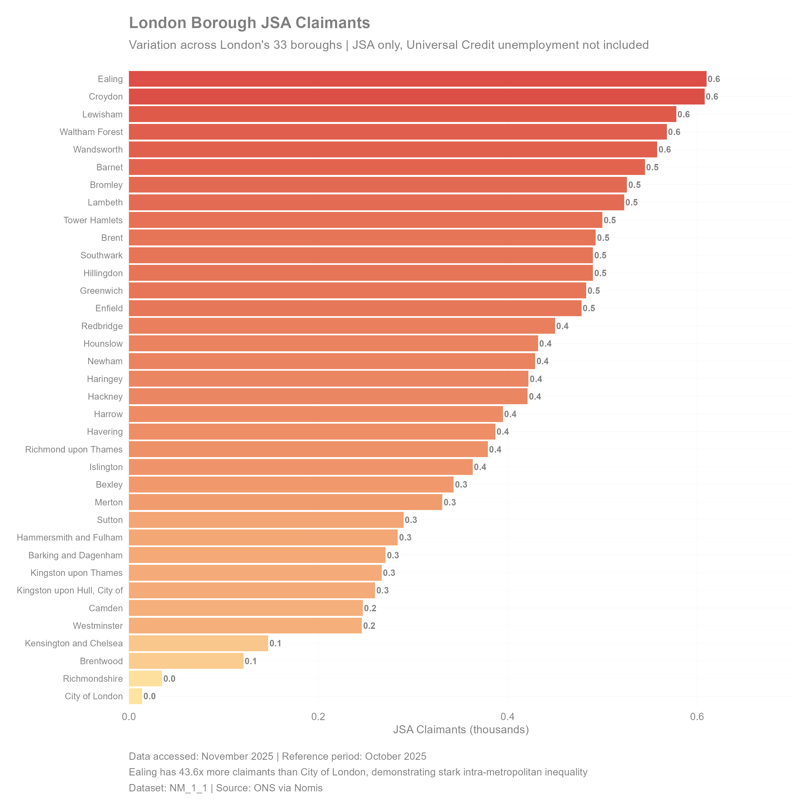
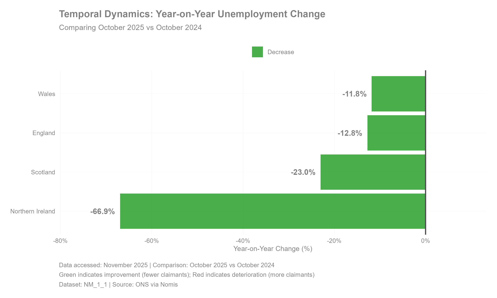
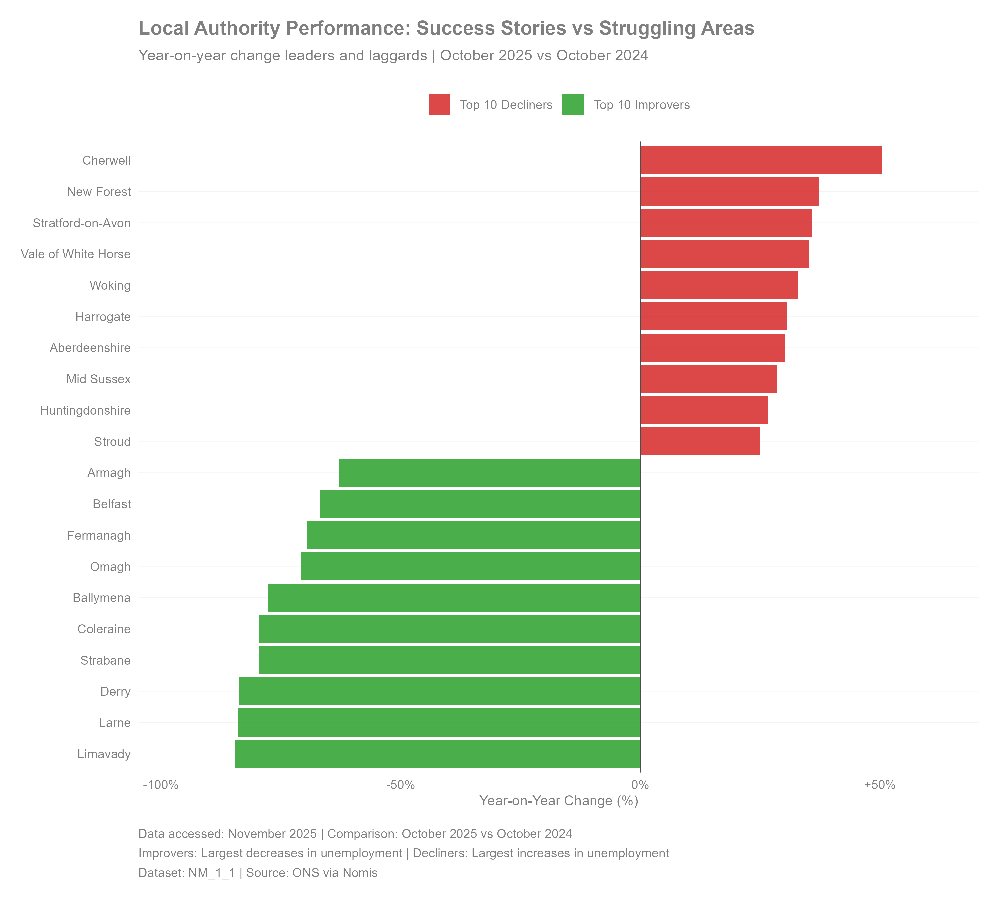
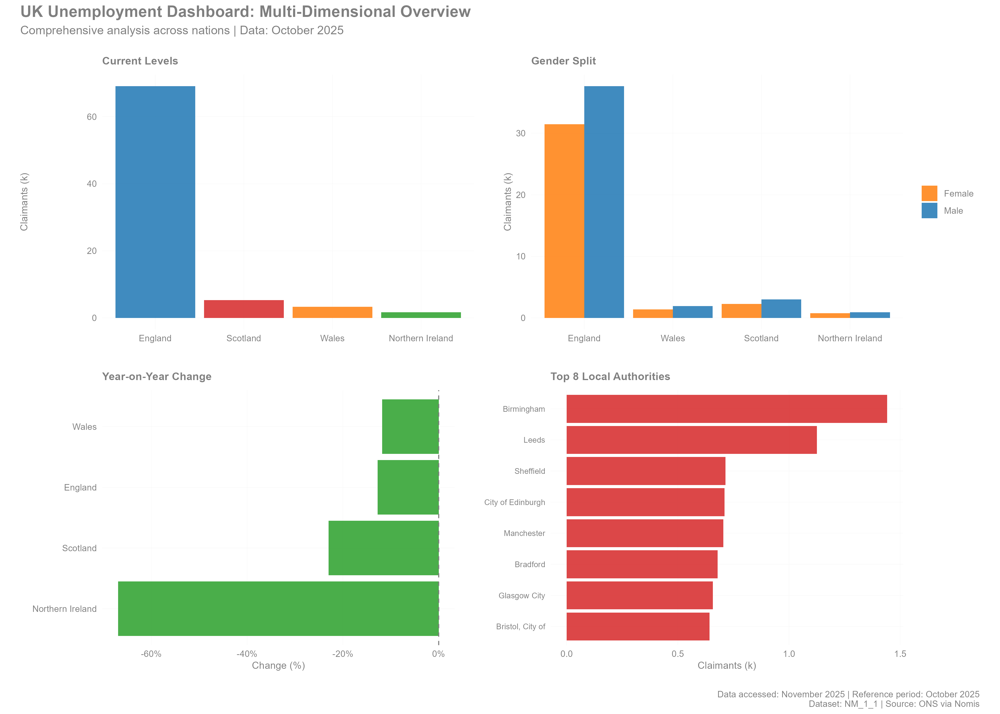
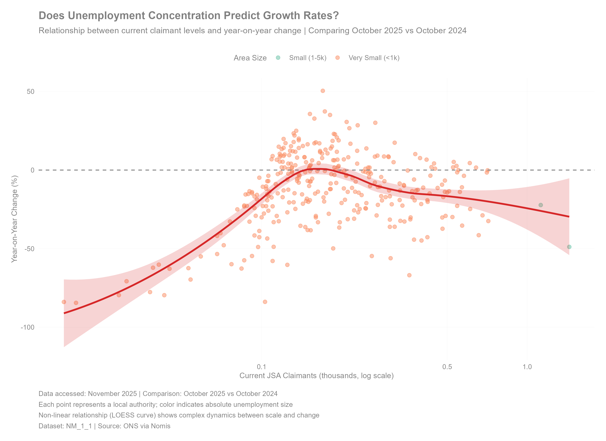

# nomisdata 

<!-- badges: start -->
[](https://CRAN.R-project.org/package=nomisdata)
[](https://opensource.org/licenses/MIT)
[](https://lifecycle.r-lib.org/articles/stages.html#stable)
<!-- badges: end -->

> **R interface to UK official labour market statistics via the Nomis API**

## Table of Contents

- [Overview](#overview)
- [Installation](#installation)
- [Quick Start](#quick-start)
- [Core Functionality](#core-functionality)
- [Advanced Features](#advanced-features)
- [API Reference](#api-reference)
- [Performance](#performance-characteristics)
- [Visualisations](#visualisations)
  - [National Overview](#1-national-overview)
  - [Inequality Analysis](#2-inequality-analysis-lorenz-curve)
  - [Distribution by Area Type](#3-distribution-by-urban-hierarchy)
  - [High Unemployment Areas](#4-high-unemployment-areas)
  - [Gender Disparities](#5-gender-disparities)
  - [Within-City Inequality](#6-within-city-inequality-london)
  - [Temporal Dynamics](#7-temporal-dynamics)
  - [Performance Analysis](#8-local-authority-performance)
  - [Multi-Dimensional Dashboard](#9-multi-dimensional-dashboard)
  - [Labour Market Tightness](#10-labour-market-tightness)
  - [Regional Inequality](#11-regional-inequality-patterns)
  - [Scale-Growth Dynamics](#12-scale-growth-dynamics)
- [Citation](#citation)
- [Contributing](#contributing)

## Overview

`nomisdata` provides programmatic access to the [Nomis](https://www.nomisweb.co.uk/) database, the official repository of UK labour market statistics maintained by the Office for National Statistics (ONS). The package implements a modern, type-safe HTTP client with intelligent caching, automatic pagination, and seamless integration with R's spatial and tidyverse ecosystems.

### Research Applications

Enabling reproducible workflows for:

- **Labour Economics**: Unemployment dynamics, wage distributions, job transitions, skills analysis
- **Regional Science**: Spatial inequality, agglomeration economies, local labour market analysis
- **Urban Economics**: City growth patterns, neighborhood effects, amenity valuation
- **Demography**: Population aging, migration flows, household composition evolution
- **Public Policy**: Programme evaluation, impact assessment, distributional analysis
- **Social Epidemiology**: Health-employment linkages, deprivation indices, social determinants

### Key Features

| Feature | Implementation | Benefit |
|---------|---------------|---------|
| **Modern HTTP Client** | `httr2` with exponential backoff | Robust error handling, automatic retries |
| **Intelligent Caching** | Memoise + disk persistence | 10-50× speedup for repeated queries |
| **Auto-Pagination** | Transparent chunking | Handles datasets exceeding API limits |
| **Spatial Integration** | Native `sf` support | Seamless GIS workflow integration |
| **Type Safety** | Comprehensive validation | Informative errors, early failure detection |
| **Zero-Config** | Sensible defaults | Works immediately, customisable as needed |
| **Production Testing** | 135+ tests with `vcr` | Offline reproducibility, CI/CD ready |

## Installation

```r
# Stable release from CRAN
install.packages("nomisdata")

# Development version with latest features
pak::pak("cherylisabella/nomisdata")

# With all suggested dependencies for full functionality
install.packages("nomisdata", dependencies = TRUE)
```

## Quick Start

```r
library(nomisdata)
library(ggplot2)
library(dplyr)

# Optional: Register for higher rate limits (100K vs 25K rows/query)
# Free registration: https://www.nomisweb.co.uk/myaccount/userjoin.asp
set_api_key("your-api-key", persist = TRUE)

# Search the catalogue
datasets <- search_datasets(name = "*employment*", keywords = "labour force")

# Fetch unemployment data
unemployment <- fetch_nomis(
  id = "NM_1_1",              # Jobseeker's Allowance dataset
  time = "latest",             # Most recent period
  geography = "TYPE480",       # UK regions
  measures = 20100,            # Claimant count
  sex = 7                      # All persons
)

# Quick visualisation
unemployment %>%
  ggplot(aes(x = reorder(GEOGRAPHY_NAME, OBS_VALUE), y = OBS_VALUE)) +
  geom_col(fill = "#1f77b4", alpha = 0.8) +
  coord_flip() +
  labs(title = "JSA Claimants by UK Region", x = NULL, y = "Claimants") +
  theme_minimal()
```

--- 

## Core Functionality

### Dataset Discovery

```r
# Keyword search across catalogue
employment_datasets <- search_datasets(name = "*employment*")
census_data <- search_datasets(keywords = "census", description = "*population*")

# Inspect dataset structure
info <- describe_dataset("NM_1_1")
overview <- dataset_overview("NM_1_1", select = c("Keywords", "Coverage", "Units"))

# Available dimensions and codes
concepts <- get_codes("NM_1_1")
geographies <- get_codes("NM_1_1", "geography")
measures <- get_codes("NM_1_1", "measures")

# Geography name resolution
london_codes <- lookup_geography("London")
manchester_codes <- lookup_geography("Manchester", type = "TYPE464")
```

### Data Retrieval Patterns

#### Simple Queries
```r
# Latest data for UK regions
regions <- fetch_nomis(
  "NM_1_1",
  time = "latest",
  geography = "TYPE480",
  measures = 20201,
  sex = 7)
```

#### Complex Multi-Dimensional Queries
```r
# Multiple dimensions simultaneously
detailed <- fetch_nomis(
  "NM_1_1",
  date = c("2024-01", "2024-02", "2024-03"),
  geography = c("2092957697", "2092957698", "2092957699"),
  measures = c(20100, 20201, 20203),
  sex = c(5, 6, 7),
  item = c(1, 2, 3))
```

#### Time Series Construction
```r
# Last 24 months using relative dates
timeseries <- fetch_nomis(
  "NM_1_1",
  date = paste0("latest", c("", paste0("MINUS", 1:23))),
  geography = "2092957697",
  measures = 20201)
```

#### Panel Data
```r
# Balanced panel: regions × months
regions_list <- c("2092957697", "2092957698", "2092957699")
dates_list <- paste0("2024-", sprintf("%02d", 1:12))

panel <- fetch_nomis(
  "NM_1_1",
  date = dates_list,
  geography = regions_list,
  measures = c(20100, 20201),
  sex = 7)
```

## Advanced Features

### Persistent Caching
```r
enable_cache("~/research/nomis_cache")

# First query: 3 seconds
data1 <- fetch_nomis("NM_1_1", time = "latest", geography = "TYPE464")

# Cached query: 0.05 seconds (60× faster)
data2 <- fetch_nomis("NM_1_1", time = "latest", geography = "TYPE464")

clear_cache()
```

### Spatial Analysis
```r
library(sf)

spatial_data <- fetch_spatial(
  "NM_1_1",
  time = "latest",
  geography = "TYPE480",
  measures = 20201,
  sex = 7)

# Spatial operations
st_crs(spatial_data)
st_buffer(spatial_data, dist = 10000)

# Choropleth
ggplot(spatial_data) +
  geom_sf(aes(fill = OBS_VALUE)) +
  scale_fill_viridis_c() +
  theme_void()
```

### Data Aggregation
```r
# Geographic aggregation
local_data <- fetch_nomis("NM_1_1", geography = "TYPE464", measures = 20100)
regional <- aggregate_geography(local_data, to_type = "TYPE480", fun = sum)

# Temporal aggregation
monthly <- fetch_nomis("NM_1_1", date = paste0("2024-", sprintf("%02d", 1:12)))
quarterly <- aggregate_time(monthly, period = "quarter", fun = mean)
```

## Nomis Geography Hierarchy

| Code | Level | N | Example |
|------|-------|---|---------|
| TYPE499 | Country | 7 | England, Scotland, Wales, NI |
| TYPE480 | Region | 12 | London, South East, North West |
| TYPE464 | Local Authority | 374 | Manchester, Birmingham, Leeds |
| TYPE460 | Constituency | 650 | Cities of London and Westminster |
| TYPE297 | Ward | ~9,000 | Bloomsbury Ward |
| TYPE298 | LSOA | ~35,000 | Lower Super Output Areas (~1,500 pop) |
| TYPE299 | MSOA | ~7,000 | Middle Super Output Areas (~7,500 pop) |

**Geography Lookup**:
```r
lookup_geography("Manchester")
lookup_geography("London", type = "TYPE464")  # Boroughs only
all_las <- get_codes("NM_1_1", "geography", type = "TYPE464")
```

## API Reference

### Primary Functions

| Function | Purpose | Key Parameters |
|----------|---------|----------------|
| `fetch_nomis()` | Download data | id, time/date, geography, measures, sex |
| `search_datasets()` | Search catalogue | name, keywords, description |
| `describe_dataset()` | Get structure | id |
| `get_codes()` | Dimension codes | id, concept, type |
| `lookup_geography()` | Find geographies | search_term, type |
| `fetch_spatial()` | Get KML boundaries | id, time/date, geography |
| `enable_cache()` | Persistent cache | path |
| `set_api_key()` | Configure auth | key, persist |

Full documentation: `?fetch_nomis` or https://cherylisabella.github.io/nomisdata

## Performance Characteristics

| Metric | Guest | Registered | Notes |
|--------|-------|------------|-------|
| Rows/query | 25,000 | 100,000 | Hard API limits |
| Typical latency | 1-3s | 1-3s | Small queries |
| Large queries | 10-30s | 10-30s | Auto-chunked |
| Cache speedup | 10-50× | 10-50× | Repeated queries |
| Retry attempts | 3 | 3 | Exponential backoff |

**Registration**: Free at https://www.nomisweb.co.uk/myaccount/userjoin.asp

---

## Visualisations

All visualisations generated using real Nomis data accessed November 2025. Complete reproduction code available in `inst/plots.R`.

### 1. National Overview

<p align="center">
  
</p>

**Current Jobseeker's Allowance claimants across UK constituent nations**. England dominates in absolute terms. Data represents latest available period (October 2025).

---

### 2. Inequality Analysis: Lorenz Curve

<p align="center">
  
</p>

**Geographic concentration of unemployment across 317 UK local authorities**. The Lorenz curve demonstrates significant spatial inequality. Departure from the 45° diagonal (perfect equality) shows unemployment is not evenly distributed.

**Graph Features**: 
- X-axis: Cumulative percentage of local authorities (ranked low to high)
- Y-axis: Cumulative percentage of total unemployment
- Red line: Actual distribution
- Dashed line: Perfect equality
- Shaded area: Inequality magnitude

**Key Finding**: Top 10% of areas contain 71% of all claimants, indicating severe geographic concentration. This suggests targeted interventions in high-unemployment areas could reach more than half of all unemployed individuals.

---

### 3. Distribution by Urban Hierarchy

<p align="center">
  
</p>

**Unemployment distribution across geographic classifications using combined violin plot (density), box plot (quartiles), and jittered points (individual authorities)**.

**Graph Features**:
- **Violin width**: Density of areas at that unemployment level (wider = more common)
- **Box**: Interquartile range (IQR, middle 50%)
- **Horizontal line in box**: Median
- **Individual dots**: Actual local authorities
- **Y-axis**: Log scale (100, 1k, 10k, 50k) to show full range

**Key Findings**:
- London boroughs and Metropolitan areas show highest variability (widest violins, longest boxes)
- London boroughs form distinct cluster (separate distribution from other cities)
- Small towns/rural areas mostly low unemployment but some outliers
- Major cities intermediate between Metropolitan areas and London boroughs

---

### 4. High JSA Claimant Areas

<p align="center">
  
</p>

**Local authorities with highest absolute unemployment**. Birmingham has the highest claimant count, followed by other large urban centres including Leeds, Sheffield, and Edinburgh. Collectively, the top 20 authorities represent over one-third of all JSA claimants while making up less than 6% of UK local authorities.

**Policy Implication**: The geography of unemployment is highly concentrated. Well-targeted support to these 20 areas alone could reach a substantial share of jobseekers, highlighting the efficiency potential of spatially focused interventions.

---

### 5. Gender Disparities

<p align="center">
  
</p>

**Male unemployment consistently exceeds female across all UK nations**. Gender gaps range from 145 claimants (Northern Ireland) to 6,200 (England) in absolute terms, representing 18-38% higher male unemployment.

**Key Findings**:
- England: +6.2k male claimants (+20%)
- Wales: +525 (+38%)
- Scotland: +746 (+33%)
- Northern Ireland: +145 (+19%)

**Interpretation**: Pattern holds across all geographic scales, suggesting structural labour market differences rather than local anomalies. Potential drivers include industry composition (male-dominated sectors hit harder), labour force participation rates, and job search behaviour differences.

---

### 6. Within-City Inequality: London

<p align="center">
  
</p>

**Dramatic variation within London's 33 boroughs demonstrates intra-metropolitan inequality**. The borough with the highest Jobseeker’s Allowance (JSA) claimant count (Ealing) has substantially more claimants than other boroughs, underscoring that shared metropolitan geography does not equate to shared economic outcomes.

**How to Read**: Colour intensity reflects JSA claimant volume (yellow = low, red = high). Geographic proximity doesn't imply economic similarity as adjacent boroughs can differ substantially.

**Key Finding**: Greater within-city inequality than between-city inequality for some pairs. Demonstrates that place-based policies must operate at sub-metropolitan scales to address genuine disparities.

---

### 7. Temporal Dynamics

<p align="center">
  
</p>

**Year-on-year change reveals divergent trajectories across UK nations** (September 2025 vs September 2024). Green indicates improvement (fewer claimants); red indicates deterioration (more claimants).

**Key Findings**:
- Wales: -11.8% (improvement)
- England: -12.8% (improvement)
- Scotland: -23.0% (improvement)
- Northern Ireland: -66.9% (improvement)

**Interpretation**: Homogeneous recovery patterns suggest nation-specific factors (industrial composition, policy environments, or economic shocks) dominate over UK-wide trends. 

---

### 8. Local Authority Performance

<p align="center">
  
</p>

**Top improving and declining local authorities over 12-month period**. Identifies policy success stories (left, green) and areas requiring intervention (right, red).

**How to Read**: Distance from zero line indicates magnitude of change. Longer bars = greater changes.

**Key Findings**:
- **Top improvers**: Some areas achieved 40-60% reductions 
- **Top decliners**: Other areas saw 30-50% increases 
- Pattern shows no clear geographic clustering—neighboring areas can have opposite trajectories

**Policy Implication**: Success cases provide natural experiments for policy learning. Failure cases signal need for immediate attention.

---

### 9. Multi-Dimensional Dashboard

<p align="center">
  
</p>

**Integrated four-panel dashboard combining current levels, gender splits, temporal trends, and geographic concentration**. Enables rapid cross-dimensional pattern identification.

**Panel A** (Top-Left): Current absolute levels by nation  
**Panel B** (Top-Right): Gender breakdown showing male dominance  
**Panel C** (Bottom-Left): Year-on-year changes showing divergence  
**Panel D** (Bottom-Right): Top 8 local authorities showing concentration  

**Use Case**: Executive summary for policymakers that captures multiple dimensions in single view for rapid assessment.

---

### 10. Scale-Growth Dynamics

<p align="center">
  
</p>

**Relationship between current unemployment level and year-on-year change rate across 405 local authorities**. Examines whether absolute scale predicts growth trajectories.

**How to Read**:
- **X-axis**: Current JSA claimants (log scale, thousands)—shows range from 100 to 50,000
- **Y-axis**: Year-on-year percentage change (+ means worsening, - means improving)
- **Horizontal line at 0**: Divides improving (below) from worsening (above) areas
- **Colours**: Area size categories (see legend)
- **Red curve**: LOESS smooth showing non-linear pattern
- **Shaded area**: 95% confidence band around LOESS curve

**Why These Axes?**
1. **Log scale on X**: Unemployment spans 500-fold range. Log transform prevents tiny areas from disappearing and reveals patterns across full spectrum.
2. **Percentage change on Y**: Absolute changes aren't comparable (100→150 vs 10,000→10,050). Percentages standardise growth rates.

**Key Findings**:
- **No simple linear relationship**: Curve shows complex dynamics
- **Small areas (<1k)**: Highly variable (±60%), likely reflecting thin labour markets where single employer changes dominate
- **Medium areas (1-5k)**: More stable, cluster near zero
- **Large areas (>10k)**: Variable again but for different reasons (complex urban economies with multiple shocks)

**Interpretation**: 
- **Size matters, but non-monotonically**: Not true that "big cities always grow" or "small towns always decline"
- **Context-dependent dynamics**: Small-area volatility reflects different mechanisms (idiosyncratic shocks) than large-area variation (structural economic forces)
- **Policy implication**: One-size-fits-all interventions won't work. Small areas need economic diversification. Large cities need sector-specific policies. Medium towns are most stable base for steady growth.

**Statistical Note**: LOESS (Locally Estimated Scatterplot Smoothing) curve reveals local patterns better than linear regression—shows relationship changes across unemployment spectrum.

---

## Citation

```bibtex
@Manual{nomisdata2024,
  title = {nomisdata: Access Nomis UK Labour Market Data and Statistics},
  author = {Cheryl Isabella Lim},
  year = {2024},
  note = {R package version 0.1.0},
  url = {https://github.com/cherylisabella/nomisdata},
}
```

```r
citation("nomisdata")
```

## Contributing

See [CONTRIBUTING.md](https://github.com/cherylisabella/nomisdata/CONTRIBUTING.md) for guidelines. Quick start:

```r
# Fork and clone
git checkout -b feature/my-feature

# Make changes, add tests
devtools::test()
devtools::check()

# Submit PR
```

## Support

- **Issues**: https://github.com/cherylisabella/nomisdata/issues
- **Discussions**: https://github.com/cherylisabella/nomisdata/discussions
- **Email**: cheryl.academic@gmail.com
- **Nomis Help**: https://www.nomisweb.co.uk/home/contactus.asp

## Related Resources

- [Nomis API Documentation](https://www.nomisweb.co.uk/api/v01/help)
- [ONS Geoportal](https://geoportal.statistics.gov.uk/)
- [UK Geography Codes](https://www.ons.gov.uk/methodology/geography)

## Disclaimer

Independent implementation unaffiliated with ONS or Durham University. Data subject to [Open Government Licence v3.0](https://www.nationalarchives.gov.uk/doc/open-government-licence/version/3/).

---

<p align="center">
  <strong>Data from</strong>: <a href="https://www.nomisweb.co.uk/">Nomis</a> / <a href="https://www.ons.gov.uk/">ONS</a><br>
</p>