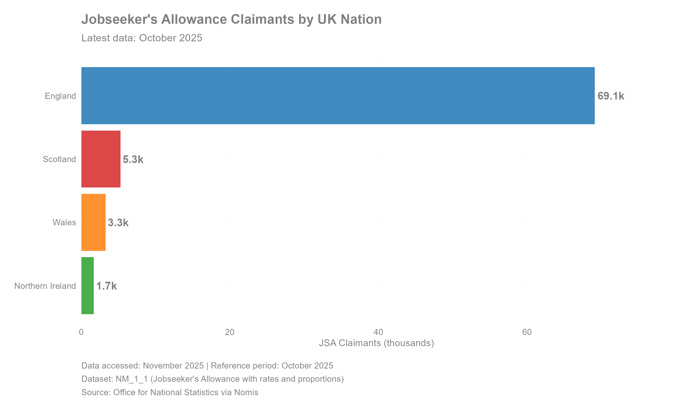
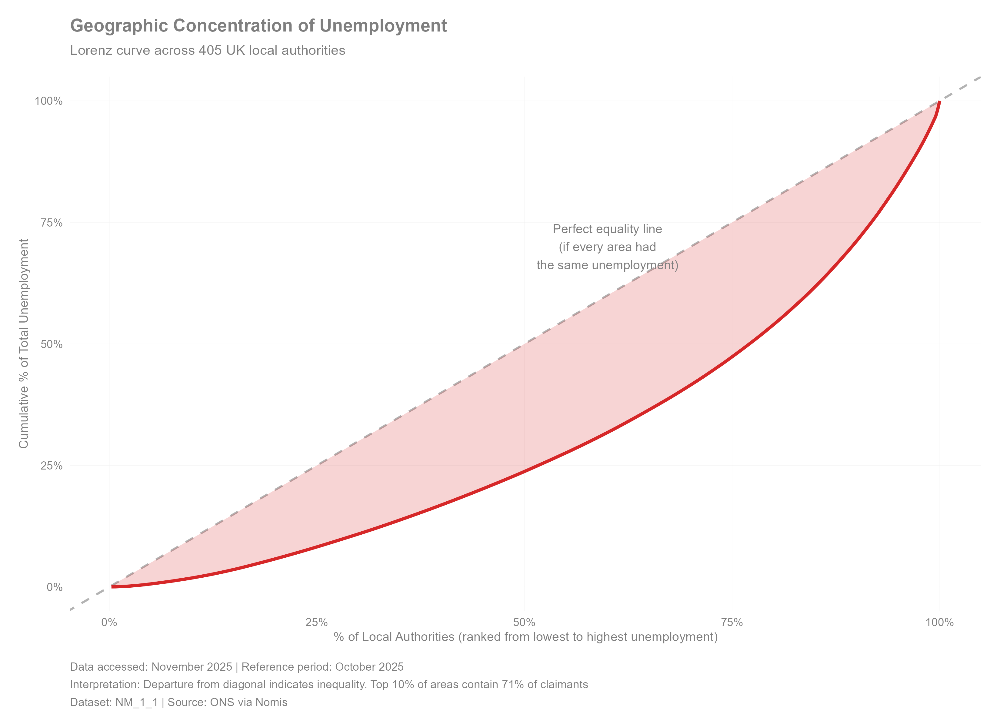
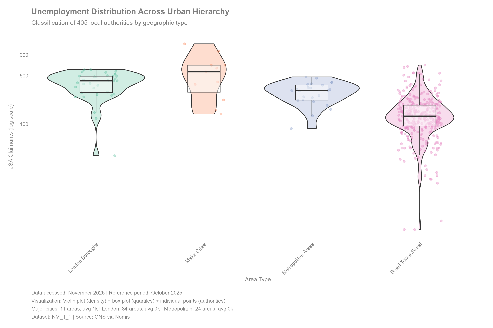
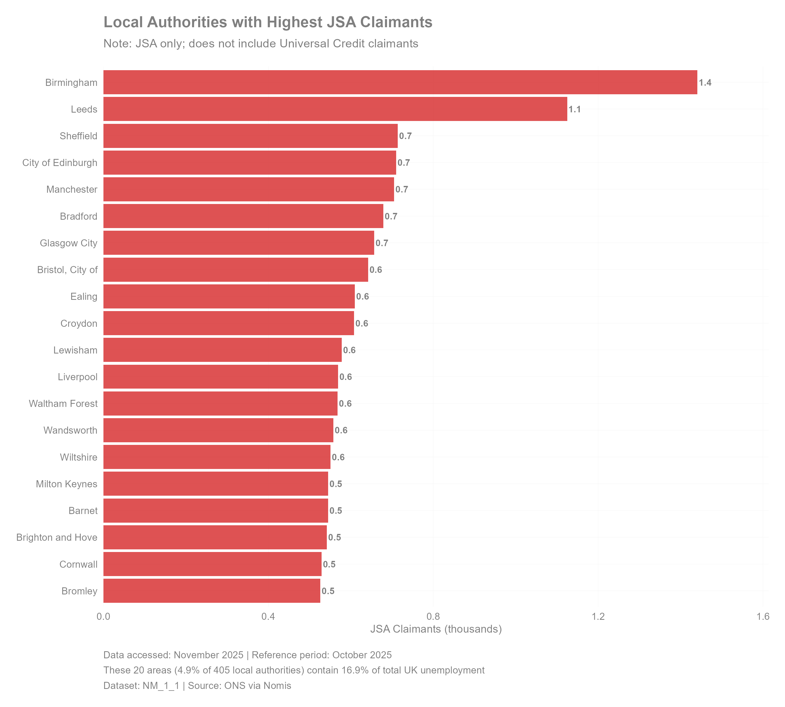
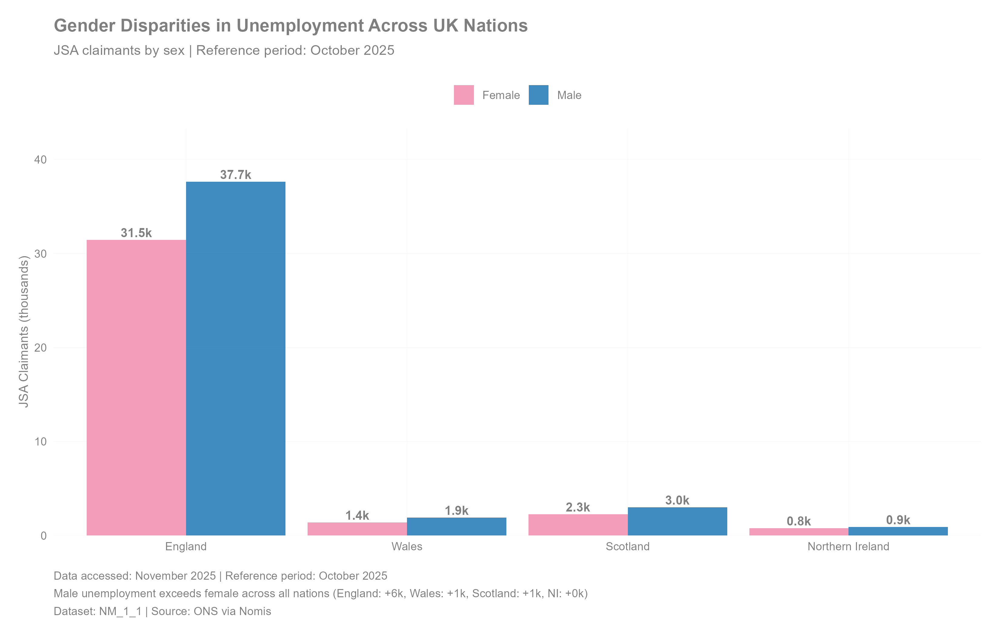
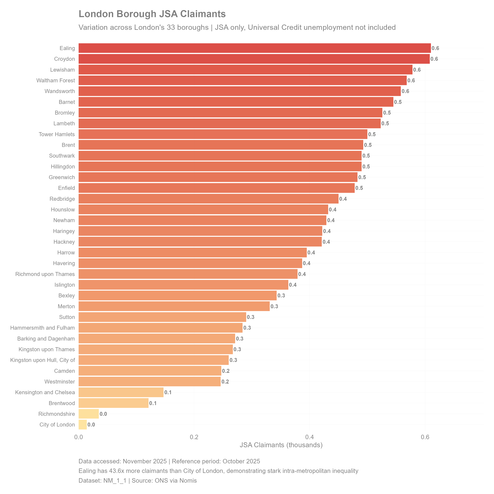
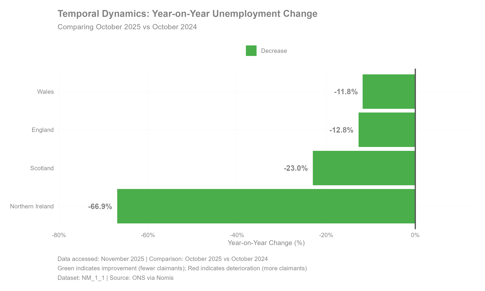
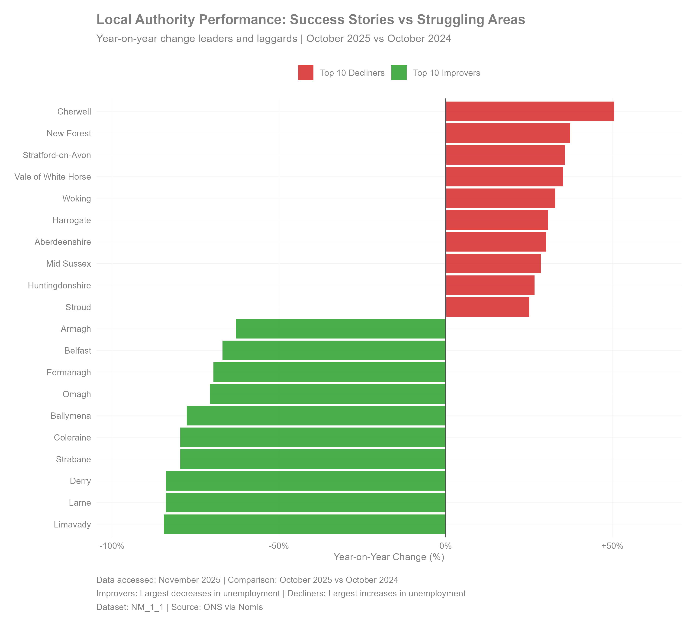
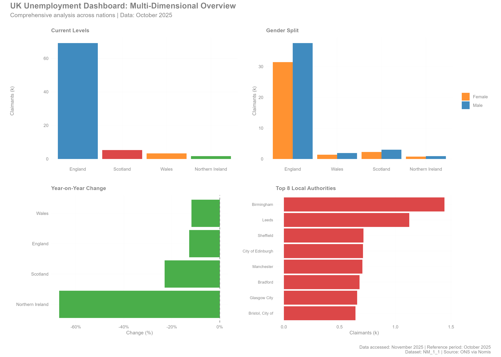
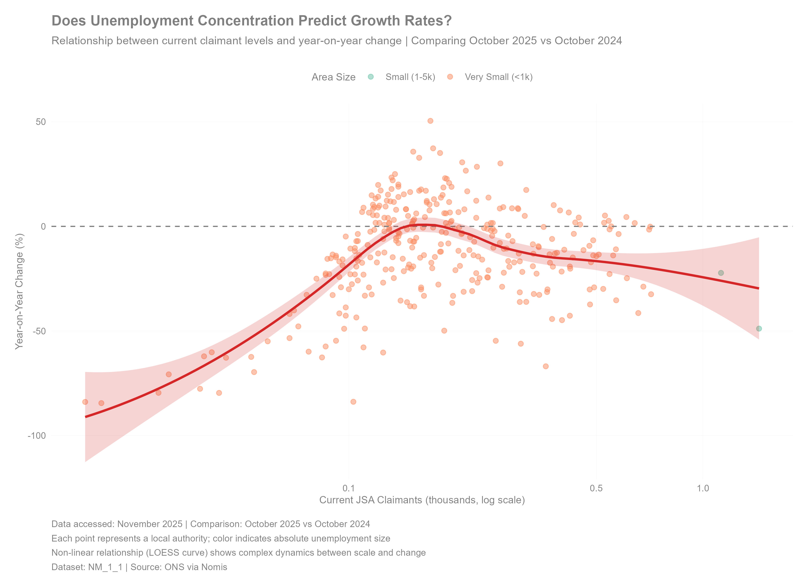

# nomisdata 

<!-- badges: start -->
[](https://CRAN.R-project.org/package=nomisdata)
[](https://opensource.org/licenses/MIT)
[](https://lifecycle.r-lib.org/articles/stages.html#stable)
[](https://cran.r-project.org/package=nomisdata)
[](https://github.com/cherylisabella/nomisdata/actions/workflows/R-CMD-check.yaml)
[](https://doi.org/10.5281/zenodo.17755834)
<!-- badges: end -->

R interface to UK official labour market statistics via the [Nomis API](https://www.nomisweb.co.uk/). Access census data, claimant counts, employment surveys, and economic indicators from the Office for National Statistics with automatic pagination, spatial integration, and tidy output.

## Installation

```r
# CRAN
install.packages("nomisdata")

# Development
remotes::install_github("cherylisabella/nomisdata")
```

## Quick Start

```r
library(nomisdata)
library(ggplot2)

# Optional: Register for 100K row limit (vs 25K guest)
# Free: https://www.nomisweb.co.uk/myaccount/userjoin.asp
set_api_key("your-key", persist = TRUE)

# Download unemployment data
unemployment <- fetch_nomis(
  id = "NM_1_1",           # JSA claimant count
  time = "latest",
  geography = "TYPE480",   # UK regions
  measures = 20100,
  sex = 7
)

# Visualise it
ggplot(unemployment, aes(reorder(GEOGRAPHY_NAME, OBS_VALUE), OBS_VALUE)) +
  geom_col(fill = "#1f77b4") +
  coord_flip() +
  labs(title = "JSA Claimants by UK Region", x = NULL, y = NULL) +
  theme_minimal()
```

## Core Functions

| Function | Purpose | Example |
|----------|---------|---------|
| `fetch_nomis()` | Download data | `fetch_nomis("NM_1_1", time = "latest", geography = "TYPE480")` |
| `fetch_spatial()` | Data + KML boundaries | `fetch_spatial("NM_1_1", time = "latest", geography = "TYPE464")` |
| `search_datasets()` | Search catalogue | `search_datasets(name = "*employment*")` |
| `describe_dataset()` | Dataset structure | `describe_dataset("NM_1_1")` |
| `get_codes()` | Dimension codes | `get_codes("NM_1_1", "geography")` |
| `lookup_geography()` | Find geography codes | `lookup_geography("Manchester")` |
| `aggregate_geography()` | Aggregate geographies | `aggregate_geography(data, to_type = "TYPE480")` |
| `aggregate_time()` | Aggregate time periods | `aggregate_time(monthly, period = "quarter")` |
| `enable_cache()` | Persistent caching | `enable_cache("~/nomis_cache")` |

Full docs: `?fetch_nomis`

## Geography Hierarchy

| Code | Level | N | Example |
|------|-------|---|---------|
| TYPE499 | Country | 7 | England, Scotland, Wales, NI |
| TYPE480 | Region | 12 | London, South East, North West |
| TYPE464 | Local Authority | 374 | Manchester, Birmingham, Leeds |
| TYPE460 | Constituency | 650 | Cities of London and Westminster |
| TYPE297 | Ward | ~9,000 | Bloomsbury Ward |
| TYPE298 | LSOA | ~35,000 | Lower Super Output Areas |
| TYPE299 | MSOA | ~7,000 | Middle Super Output Areas |

```r
# Find codes by name
lookup_geography("Manchester")
lookup_geography("London", type = "TYPE464")  # Boroughs only

# Get all codes for a level
get_codes("NM_1_1", "geography", type = "TYPE464")
```

## Advanced Example: Spatial Analysis

```r
library(sf)

# Download with boundaries
spatial <- fetch_spatial(
  "NM_1_1",
  time = "latest",
  geography = "TYPE464",  # Local authorities
  measures = 20100,
  sex = 7
)

# Choropleth map
ggplot(spatial) +
  geom_sf(aes(fill = OBS_VALUE), color = NA) +
  scale_fill_viridis_c(option = "magma", name = "Claimants") +
  theme_void() +
  labs(title = "JSA Claimants by Local Authority")
```

## Visualisations

All plots use real Nomis data (November 2025). Reproduction code in `inst/plots.R`.

### 1. National Overview

<p align="center">
  
</p>

Current JSA claimants across UK constituent nations. England dominates in absolute terms (October 2025).

---

### 2. Inequality: Lorenz Curve

<p align="center">
  
</p>

**Geographic concentration across 317 UK local authorities**. Top 10% of areas contain 71% of all claimants.

- **X-axis**: Cumulative % of local authorities (ranked low to high)
- **Y-axis**: Cumulative % of total unemployment
- **Red line**: Actual distribution
- **Dashed line**: Perfect equality

**Policy implication**: Targeted interventions in high-unemployment areas could reach majority of unemployed.

---

### 3. Distribution by Urban Hierarchy

<p align="center">
  
</p>

Combined violin plot (density), box plot (quartiles), and individual points showing unemployment distribution across geographic classifications.

**Key findings**:
- London boroughs and Metropolitan areas show highest variability
- Small towns/rural areas mostly low but some outliers
- Major cities intermediate

---

### 4. High Claimant Areas

<p align="center">
  
</p>

Top 20 authorities represent over one-third of all JSA claimants while making up less than 6% of UK local authorities.

---

### 5. Gender Disparities

<p align="center">
  
</p>

Male unemployment consistently exceeds female across all UK nations. Gender gaps range from 18-38% higher male unemployment.

**Findings**:
- England: +6.2k male claimants (+20%)
- Wales: +525 (+38%)
- Scotland: +746 (+33%)
- Northern Ireland: +145 (+19%)

---

### 6. Within-City Inequality: London

<p align="center">
  
</p>

Dramatic variation across London's 33 boroughs. Colour intensity reflects claimant volume (yellow = low, red = high).

**Key finding**: Greater within-city inequality than between-city inequality for some pairs.

---

### 7. Temporal Dynamics

<p align="center">
  
</p>

Year-on-year change (September 2025 vs 2024). Green = improvement, red = deterioration.

All UK nations show improvement ranging from -11.8% (Wales) to -66.9% (Northern Ireland).

---

### 8. Local Authority Performance

<p align="center">
  
</p>

Top improving (green) and declining (red) local authorities over 12 months. Success cases provide natural experiments for policy learning.

---

### 9. Multi-Dimensional Dashboard

<p align="center">
  
</p>

Four-panel dashboard: current levels, gender splits, temporal trends, and geographic concentration. Executive summary for rapid assessment.

---

### 10. Scale-Growth Dynamics

<p align="center">
  
</p>

**Relationship between current unemployment and year-on-year change across 405 local authorities**.

**How to read**:
- **X-axis**: Current JSA claimants (log scale)
- **Y-axis**: Year-on-year % change (+ = worsening, - = improving)
- **Red curve**: LOESS smooth showing non-linear pattern
- **Shaded area**: 95% confidence band

**Key findings**:
- Small areas (<1k): Highly variable (±60%), thin labour markets
- Medium areas (1-5k): More stable, cluster near zero
- Large areas (>10k): Variable but from structural forces

**Policy implication**: One-size-fits-all won't work. Small areas need diversification. Large cities need sector-specific policies. Medium towns most stable.

---

## Common Datasets

- `NM_1_1` - JSA claimant count
- `NM_162_1` - Annual Population Survey employment
- `NM_17_5` - Annual Survey of Hours and Earnings
- `NM_2010_1` - Census 2021 (England and Wales)

Search all: `search_datasets()`

## Related Resources

- [Nomis API Documentation](https://www.nomisweb.co.uk/api/v01/help)
- [ONS Geoportal](https://geoportal.statistics.gov.uk/)
- [UK Geography Codes](https://www.ons.gov.uk/methodology/geography)

## Citation

```r
citation("nomisdata")
```

## Disclaimer

Independent implementation unaffiliated with ONS or Durham University. Data subject to [Open Government Licence v3.0](https://www.nationalarchives.gov.uk/doc/open-government-licence/version/3/).

---

<p align="center">
  <strong>Data from</strong>: <a href="https://www.nomisweb.co.uk/">Nomis</a> / <a href="https://www.ons.gov.uk/">ONS</a>
</p>
